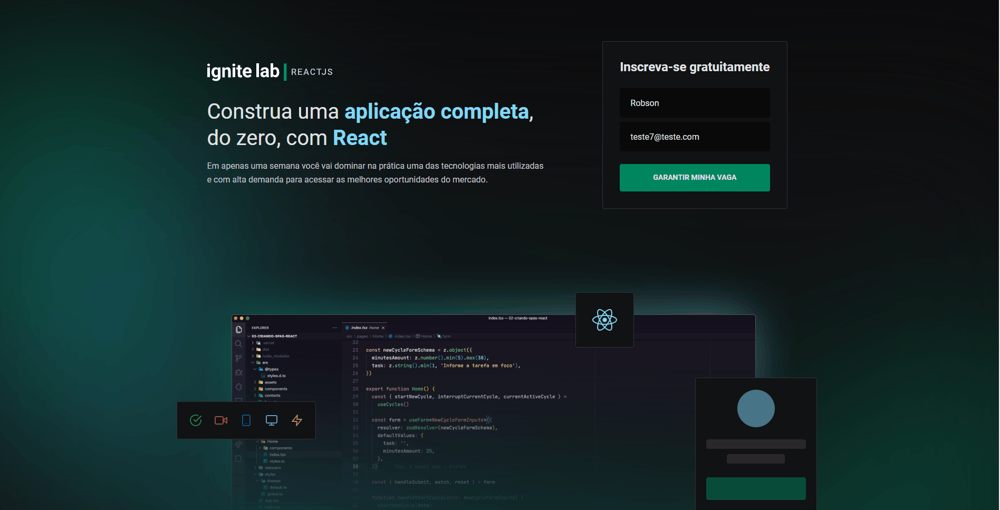

# Event-platform - Ignite Lab

## Sobre o projeto

Event platform é uma aplicação web desenvolvida em React, a ferramenta apresenta aulas que são liberadas em horarios especificos,
o projeto foi desenvolvido durante o ignite lab 2 pela Rocketseat.

## Demo



## Tecnologias

 - Vite
 - React
 - TailwindCSS
 - GraphCMS

## Instalação e uso

```
# Clone o repositório
git clone https://github.com/Robson-GDS/event-platform.git

# Acesse a pasta do projeto
cd event-platform

# Instale as dependências
npm install

# Execute a aplicação
npm run dev

```
